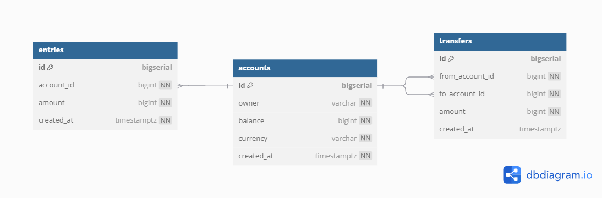

# Simple Bank

It will provide APIs for the front-end to do following things:
1. Create and manage account
2. Record all balance changes
3. Money transfer transactions

## What tech this project use?
Go-Lang, Postgres, Redis, Gin, gRPC, Kubernetes, AWS, CI/CD  
<i>on development...</i>

## Database Schema
This is the database schema for this project:  
  
or you can access is directly [here](https://dbdiagram.io/d/Simple-Bank-678a4ceb6b7fa355c336c916).

### to be continued~